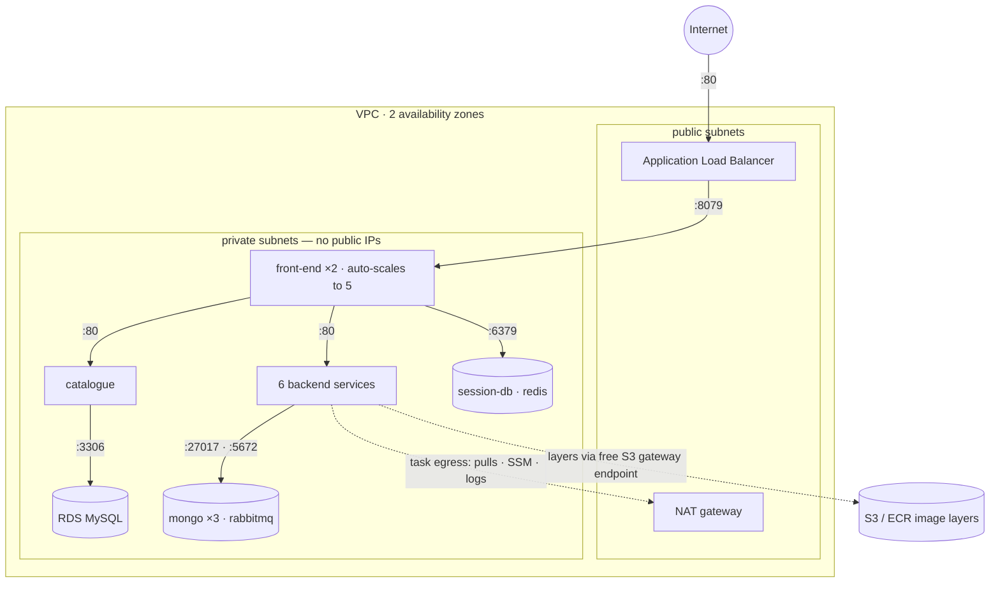
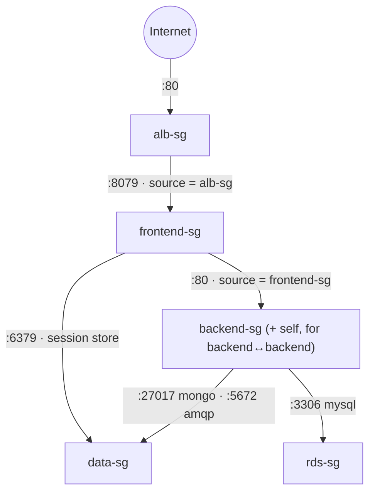
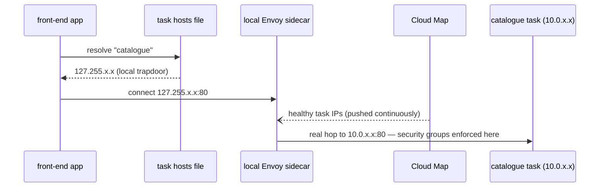

# 01 — Architecture & Design Rationale

This document covers the system's design and the reasoning behind the technology choices. The trade-off list can be found in [04-tradeoffs.md](04-tradeoffs.md); production recommendations can be found in [05-production-roadmap.md](05-production-roadmap.md).

**Stack:** 
I used AWS services, used ECS on Fargate for compute, used Terraform with remote state on S3 for IaC, used GitLab for CI/CD, used AWS ECR as a container registry, used AWS CloudWatch for monitoring and used the application pre-built microservice images deployed as-is.

## HLD of the infrastructure and network flow

How to read it: every arrow inside the VPC is enforced by a security-group rule (diagram below); the ALB is the system's only public entry; all application compute and data live in private subnets with no inbound route from the internet.

## Infrastructure Components

**Network.** One VPC across two availability zones. Public subnets contain only the ALB and a single NAT gateway; private subnets contain every task and the database. Isolation is two independent layers: routing decides what is *reachable* (private subnets have no inbound internet path and tasks carry no public IPs), and security groups decide what may *connect* (identity-based rules at each task's own network interface). Egress follows a route-table fork: traffic to S3's IP ranges — which is where ECR stores image layers — rides a free S3 gateway endpoint; everything else exits through the NAT.

**Compute.** ECS on Fargate. Thirteen services created from one reusable Terraform module (ecs-services); each task runs in its own micro-VM with its own elastic network interface in my subnets, so isolation is a hardware-virtualization boundary rather than a shared kernel. Sizing follows the runtime: Java services get 0.5 vCPU / 1 GiB, Go and Node services 0.25 vCPU / 512 MiB. Deployments are rolling, guarded by ECS's deployment circuit breaker with automatic rollback to the last healthy revision.

**Service discovery.** ECS Service Connect: a Cloud Map namespace plus an Envoy proxy injected into every task. Discovery names match the hostnames hard-coded into the 2016–2018 application binaries character for character (`catalogue`, `carts-db`, `rabbitmq` — the images look for plain names, so the registry must answer to exactly those names). Because a service's endpoint list is snapshotted per *deployment*, Terraform's dependency graph (order of deployment) deploys the components bottom-up: data tier, then backends, then front-end last.

**Data.** The catalogue's relational store is RDS MySQL (db.t4g.micro, `multi_az` as a variable), data is seeded to the DB by an ECS task (like a job) from a SQL dump committed to this repository. The remaining stores — three MongoDB containers, a Redis session store, RabbitMQ — run deliberately as ephemeral Fargate containers.

**Ingress.** A single Application Load Balancer replaces the compose file's edge-router container. The target group is IP-type (Fargate tasks register their ENI addresses), health checks gate which tasks receive traffic, and a 30-second deregistration delay drains in-flight requests during deployments — which is what makes rolling updates and task replacement invisible to users.

## Decisions made

Each decision below follows the same shape: context → options → choice → why.

### 1. ECS on Fargate instead of EKS

**Context:** a time-boxed assessment whith requirements like high availability, scalability, fault tolerance, and container orchestration — not Kubernetes specifically. **Options:** EKS, ECS on EC2, ECS on Fargate. **Choice:** ECS on Fargate. **Why:** it delivers every required outcome with the smallest operational and time cost — no control-plane fee (EKS charges $0.10/hour per cluster whether idle or not), per-second billing only while tasks run, and apply cycles measured in minutes rather than the time consuming EKS iterations that would have consumed the time box. the concepts map one-to-one (task = pod, task definition = pod spec, ECS service = Deployment, Service Connect = Service DNS, target tracking = HPA).

### 2. Fargate rather than the EC2 launch type

**Context:** within ECS, tasks can run on self-managed EC2 instances or on Fargate. **Options:** EC2 launch type (cheaper at sustained scale, node-level control), Fargate. **Choice:** Fargate. **Why:** zero node operations and less time consumption, and hard per-task isolation. The trade is explicit: Fargate collapses request, limit, and bill into one guaranteed number — no overcommit, no bursting into idle neighbor capacity.

### 3. RDS MySQL replaces the catalogue-db container

**Context:** in the application github repo, the application ships catalogue-db as a self-seeding MySQL container; the assessment explicitly requires provisioning databases and demonstrating fault tolerance. **Options:** keep the container, or move to RDS. **Choice:** RDS. **Why:** a database container on Fargate has ephemeral storage and cannot provide failover without real replication engineering; RDS provides Multi-AZ synchronous failover behind a single flag, plus automated backups. The application contract is untouched — same MySQL protocol, same schema; one hostname changed inside a connection string. The seed data was extracted from the original image's init script and committed to this repo, executed by an ECS task (job).

### 4. The ALB replaces edge-router

**Context:** in the application github repo, the application front door is a Traefik container whose entire routing table forwards to front-end; the assessment names load balancers as a required component. **Options:** keep edge-router (optionally behind an ALB), or ALB only. **Choice:** ALB only. **Why:** the ALB does the router's whole job and adds multi-AZ resilience, health-checked rotation, connection draining, and the CloudWatch metrics that both the monitoring stack and the auto-scaling policies consume. A proxy in front of a proxy would add a hop and configuration for no value.

### 5. OIDC federation instead of stored CI credentials

**Context:** the pipeline must authenticate to AWS to plan, apply, push images, and deploy. **Options:** an IAM user's access keys stored as CI variables, or OpenID Connect federation. **Choice:** OIDC. **Why:** the pipeline holds zero long-lived credentials. Each job exchanges a GitLab-signed identity token — whose claims are asserted by the platform and cannot be forged by a job — for one-hour STS credentials. The IAM trust policy pins the token's audience and the *immutable numeric project ID* (not the recyclable project path).

### 6. Images mirrored through ECR, not pulled from Docker Hub at runtime

**Context:** the application ships as pre-built public images from an archived upstream project. **Options:** reference Docker Hub directly in task definitions, or mirror images through my own registry. **Choice:** mirror — the pipeline pulls each pinned upstream image, scans it with Trivy, and pushes it to ECR tagged with both the commit SHA and a `:stable` pointer. **Why:** two reasons. mirroring makes scan → freeze (push to ECR) → deploy one unbroken chain. Fault tolerance — image pulls happen at task launch, which is exactly when self-healing and scale-out occur; that moment must not depend on a rate-limited third-party registry (all tasks share one NAT IP) hosting images from an archived project that could vanish. Cost and speed — ECR serves layers from same-region S3 through the free gateway endpoint instead of the NAT's per-gigabyte meter.

## Security-group chain

Each tier admits connections only from the security group of the tier directly upstream — by group identity, not IP addresses, so membership survives task churn. The chain is the application's call graph written as firewall rules, enforced at every task's own network interface. Egress is open by design: security groups are stateful, so the chain is fully enforced on who may *initiate*, while image pulls, secret injection, and log shipping originate outbound. Notably absent paths: the internet cannot reach any task or the database; the ALB cannot reach backends; the front-end cannot reach any database except its own session store.

## Service Connect name resolution

The application only ever speaks names; the proxy (Service Connect) only ever speaks IPs. Task IPs churn freely — Cloud Map pushes updates to every proxy — but the *name list* a client can resolve is snapshotted when its deployment is created, not when a task launches. Two operational consequences, both encoded in this repo: services deploy in call-graph order (data tier → backends → front-end), and adding a new service later requires a forced new deployment of its callers.

---

*Next: [02-setup-and-run.md](02-setup-and-run.md) — building this system from scratch.*
